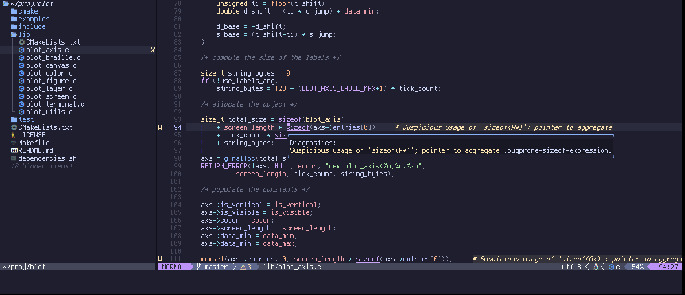

# about

This is my neovim config for C/C++ development.



# insturctions

## dependencies

You'll probably have to install some tools...
```
sudo apt install clang clangd npm
```

## neovim from source

You will need neovim 0.10, or at least 0.9 for some of these plugins.
I found building it from source pretty easy on Debian/Ubuntu.

```
sudo apt install libgettextpo-dev gettext
git clone https://github.com/neovim/neovim
cd neovim
mkdir -p ~/usr
make CMAKE_BUILD_TYPE=RelWithDebInfo CMAKE_INSTALL_PREFIX=$HOME/usr/neovim
make install
```

Note that I installed things in `~/usr/neovim`, which means it needs to go in the PATH.
Alternatively you can make aliases for them in your `~/.bashrc` (or whatever shell you use).
```
alias vim=~/usr/neovim/nvim
alias vi=~/usr/neovim/nvim
alias vimdiff='~/usr/neovim/nvim -d'
```

## installing these configs

Move the old config out of the way, if you have one...
```
mv ~/.config/nvim ~/.config/nvim.old
```

Then copy over the files under `config/nvim`...

```
mkdir -p ~/.config/nvim/
cp -r config/nvim/* ~/.config/nvim/
```

and start things up
```
vim
```


# shoutouts

based on this video series:
* https://www.youtube.com/watch?v=zHTeCSVAFNY by `typecraft` (thank you)
